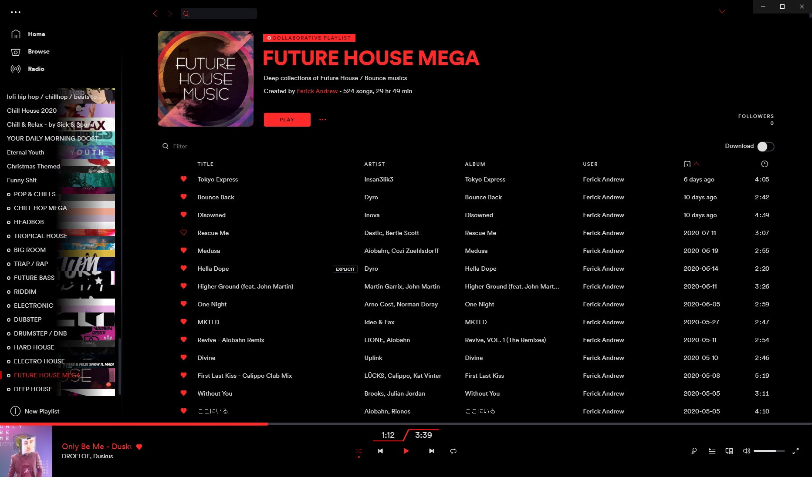
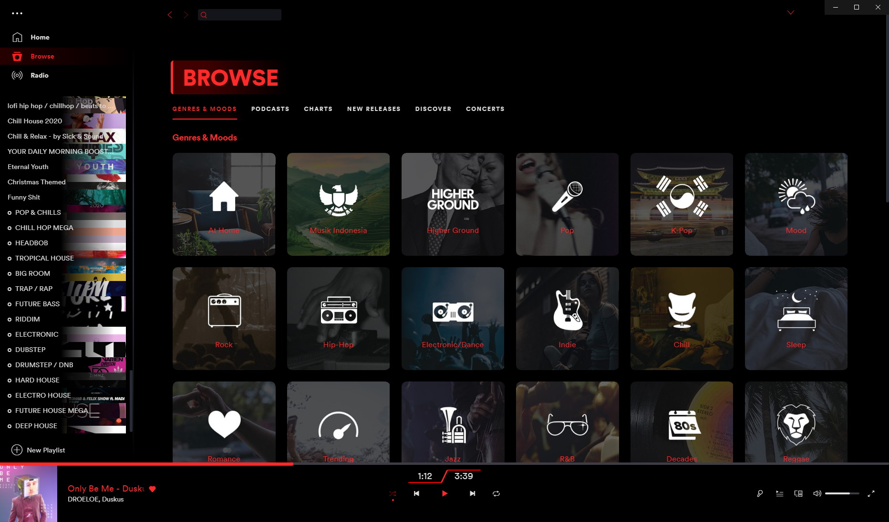
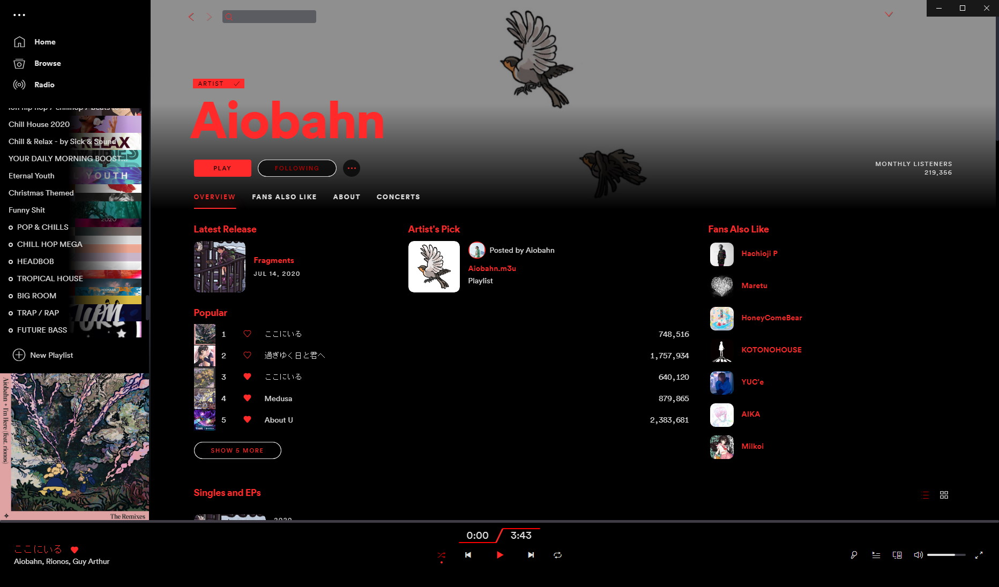

# Bloody v2

Apply the theme by copying the file into ~/spicetify-cli/Themes and run ...
```
spicetify config current_theme Bloody-v2 && spicetify apply
```

## Screenshots

### Playlist

### Browse

### Artist Page


## More

Bloody V2 is a modded theme of [Bloody](https://github.com/morpheusthewhite/spicetify-themes/tree/master/Bloody), which is also a modded theme of SpicetifyDark
